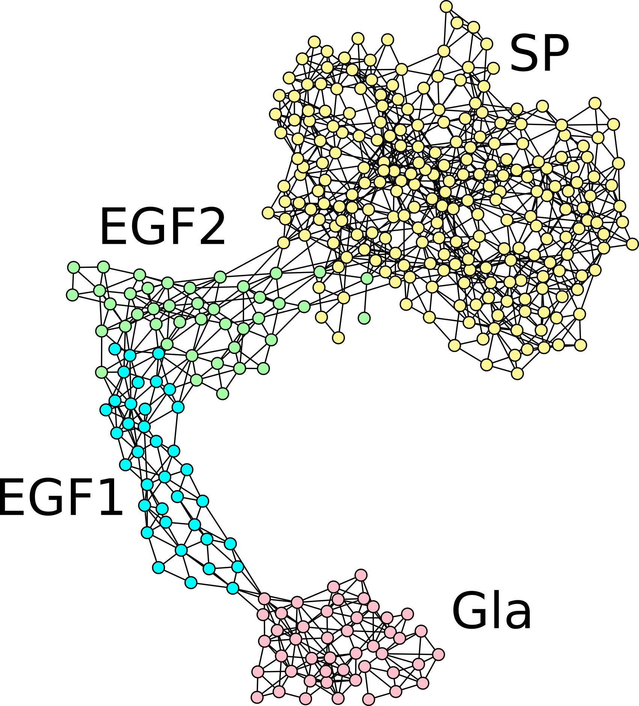

# HemaB-Class – v1.0

### Thanks for your interest in using HemB-Class.



Hemophilia B is a relatively rare hereditary coagulation disorder, caused by the synthesis of defective Factor IX protein (FIX). This condition impairs the coagulation cascade, and if left untreated, causes permanent joint damage and poses a risk of fatal intracranial hemorrhage in case of traumatic events. In its severe form, patients who have access to supportive health care systems can benefit from prophylactic treatment, which consists of regular life-long administrations of recombinant forms of the FIX protein.

We designed a machine learning framework for hemophilia B classification (HemB-Class), and even though our training data was limited, after careful optimization HemB-Class was able to identify properties related to severe and mild or moderate forms of the disease. 

We predicted the severity of all residues not yet reported in the medical literature and confirmed its agreement with clinical data, and with in vitro mutagenesis assays.

Here you will find the datasets and the source code used in the manuscript <a href="https://www.frontiersin.org/articles/10.3389/fbinf.2022.912112/full" target="_blank">“A machine learning framework predicts the clinical severity of Hemophilia B caused by point-mutations”</a>, by Tiago Lopes, Tatiane Nogueira and Ricardo Rios (Frontiers in Bioinformatics, 2022).

Please note that we cannot make available the data from other databases; to access the complete mutation datasets, please visit the EAHAD and the CHAMPS websites.

The organization of the material is:

> - **/dataset** - contains the datasets to reproduce our findings and create the figures.
> - **/src** - contains the source code for the machine learning framework and for other analyses.
> - **/results** - you can find the pre-trained classification models in this folder.
> - **/workdir** - please execute the code when you are inside this directory.

To reproduce all experiments using individual ML classification models on the training dataset, please run the source codes:

```Prolog
Rscript workdir/run-all.R
```
You can also open R and run:

```Prolog
source("workdir/run-all.R")
```
To make predictions and produce roc curves, run one of the following commands:

```Prolog
Rscript src/visualization/prediction-visualization.R 
source("src/visualization/prediction-visualization.R")
```
In this code, the prediction ensemble was created only combining two classifers to illustrate our contribution. Users can modify it to better address their applications.

To reproduce the heatmap published in our mansucript, run one of the following commands:

```Prolog
Rscript src/visualization/make_heatmap_predictions.R
source("src/visualization/make_heatmap_predictions.R")
```

If you find any issues with the code, please contact us: tiago-jose@ncchd.go.jp, ricardoar@ufba.br, tatiane.nogueira@ufba.br

On the behalf of all of the authors, we appreciate your interest in HemB-Class and hope it is useful to your research.

